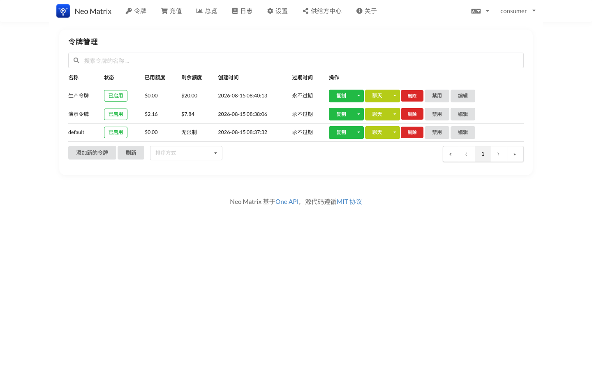
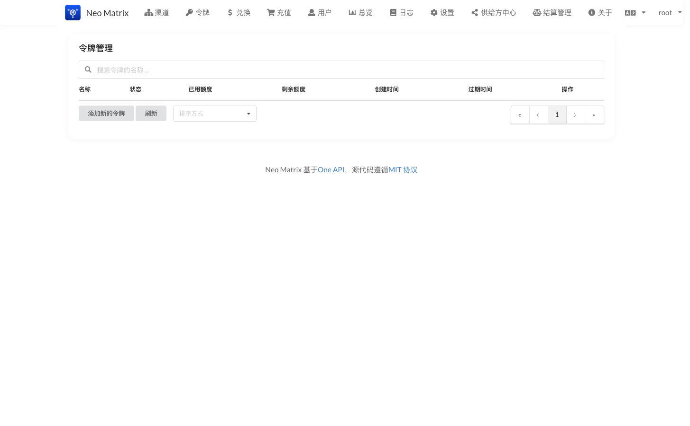
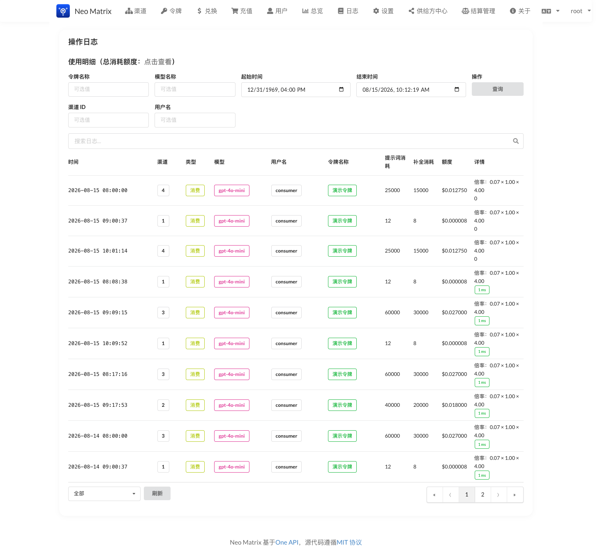
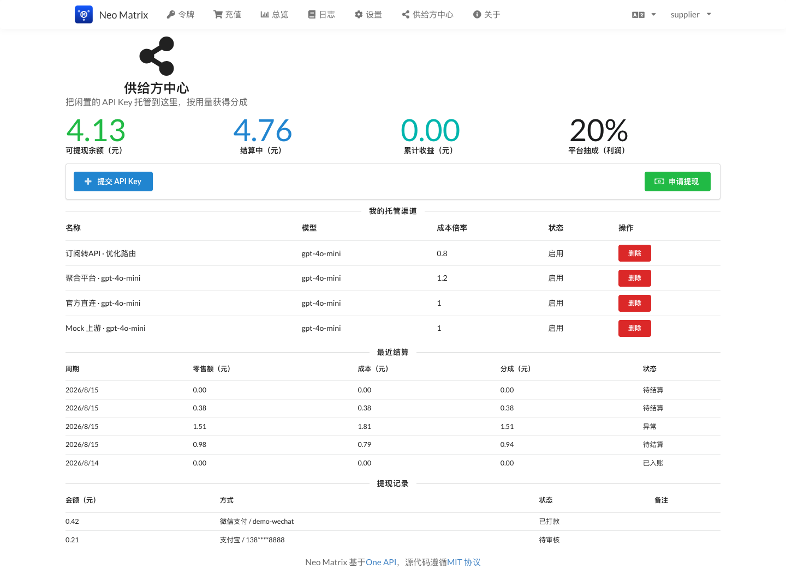
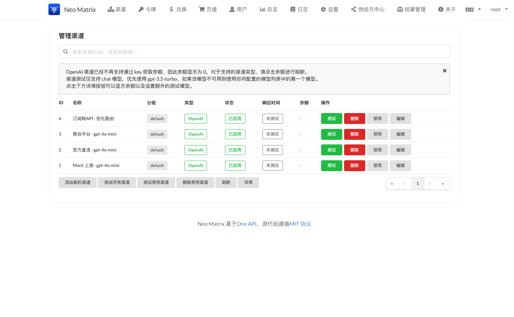
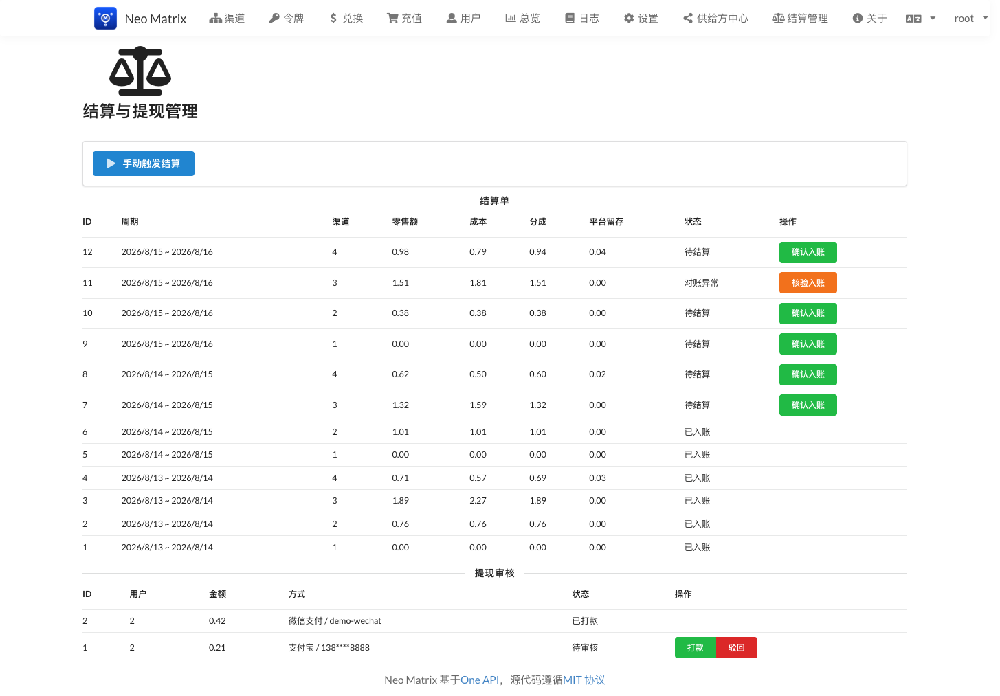

# Neo Matrix —— 共享 AI 中转站：把闲置 API Key 汇成一个入口

> 基于 one-api（MIT）二次开发的**共享 AI 中转站**：消费者通过一个标准 OpenAI 兼容接口访问所有大模型；供给方把闲置 API Key 托管到平台，平台自动调度这些 Key 处理请求，并按真实用量给供给方分成、可提现。


## 它解决什么问题

大家手里通常有好几个 API Key：OpenAI、DeepSeek、Gemini、各种聚合平台…… 用的时候要在不同服务商之间切换、分别计费、分别管理余额。Neo Matrix 把这些 Key **汇总成一个入口**：

- **消费者**：只认一个 `sk-xxx` 令牌，所有模型在一个地方按用量付费，不用管背后是哪个上游在服务。
- **供给方**：闲置的 Key 不再吃灰，托管到平台就能按真实消耗获得分成，钱可以提现。
- **平台**：同一模型有多家供给方时，自动走**成本最优**的渠道，把平台利润做大。

## 核心概念：平台令牌 vs 上游 Key

理解 Neo Matrix，先分清两把"钥匙"：

| | 消费者令牌（平台签发） | 上游 Key（供给方托管） |
|---|---|---|
| 谁持有 | 消费者（`sk-` 开头，平台生成） | 供给方（OpenAI/DeepSeek 等官方 Key） |
| 发给谁 | 平台签发，`/api/token` 创建 | 供给方在中心页"提交 API Key" |
| 用途 | 调 `/v1/chat/completions` | 平台用它去调上游 |
| 谁能见 | 只有持有者 | 平台管理端可见 |

**关键点：消费者拿到的 key 是平台发的令牌，不是任何上游的 key。** 消费者请求打到平台后，由**平台的调度算法**决定这个请求交给哪个供给方的 Key 去处理——消费者无感知，也决定不了用哪家。

## 架构一览

Neo Matrix 完整继承 one-api 的能力：40+ 上游渠道适配、额度计费、分组权限、渠道健康监控。在它之上，本项目增加了一条完整的**供给侧经济闭环**：

```
消费者 (sk-xxx 平台令牌)
   │  标准 OpenAI 兼容 API /v1/chat/completions
   ▼
Neo Matrix 平台
   │  ├─ 成本最优路由：同模型多渠道，按成本倍率 × 信任加权随机选路
   │  ├─ 消费日志记账：零售价（消费者付） + 成本价（付给上游）
   │  └─ 分成结算：按周期聚合日志 → 平台与供给方按比例分账
   ▼
上游渠道（供给方托管的 Key，平台调度分发）
```

## 快速上手：两种身份

### 我是消费者

1. 注册账号，充值（或管理员充值），在 **令牌页** 创建自己的 `sk-` 令牌：

   

2. 用标准 OpenAI 接口调用，`model` 填平台提供的模型名：

   ```bash
   curl http://localhost:3000/v1/chat/completions \
     -H "Authorization: Bearer sk-你的令牌" \
     -H "Content-Type: application/json" \
     -d '{"model":"gpt-4o-mini","messages":[{"role":"user","content":"你好"}]}'
   ```

3. **价格怎么看？** 消费者价 = 平台统一零售价（`ModelRatio`，锚定官方公开价）。平台总览页能看到全平台消耗趋势，令牌页能看到每个令牌的剩余额度：

   

   消费日志页显示每一笔的扣费（零售价）——**同一模型，无论背后走哪个渠道，消费者价格不变**。

   

### 我是供给方

1. 注册账号 → 申请成为供给方 → 管理员审批通过。
2. 在 **供给方中心** 点"提交 API Key"，填写渠道类型、Key、成本倍率，平台自动校验 Key 有效性：

   

3. 通过后，你的 Key 参与调度，消费产生的**分成**按周期结算进你的账户，可提现。

## 三种身份的界面

| 身份 | 主界面 | 截图 |
|---|---|---|
| 管理员 | 渠道管理 / 结算与提现 / 用户管理 | 见下方 |
| 供给方 | 供给方中心（余额 + 托管渠道 + 最近结算） | [供给方中心](images/10-supplier-center.png) |
| 消费者 | 用量总览 + 令牌管理 | [消费者看板](images/12-dashboard-consumer.png) |

### 管理员：渠道管理

平台管理端能看到所有渠道。4 个演示渠道展示了不同档位的成本倍率与信任等级——这正是"成本最优路由 + 信任阶梯"的可视化：

- **官方直连 · gpt-4o-mini**：成本 1.0（= 官方价），信任 5（最高）
- **聚合平台 · gpt-4o-mini**：成本 1.2（聚合路由有溢价），信任 4
- **订阅转API · 优化路由**：成本 0.8（低于官方价 → **待成本申报审批**），信任 2（新渠道爬坡期）



> 注意"订阅转API · 优化路由"渠道：它的成本倍率 0.8 < 1.0，按规定必须走**成本申报**由管理员核准后才能放开成本下限。这是防止"低报抢调度量"的关键设计。

## 调度算法：这个请求到底给谁？

这是 Neo Matrix 的核心。同模型有多个渠道时，**不是随机派发，也不是只挑最便宜的**，而是按 **`1 / (成本倍率 × 信任惩罚)`** 加权随机：

1. 先按**优先级**分组，只在最高优先级这一组里选（`priority` 高的渠道优先承接）。
2. 组内按 `WeightFactor = 1 / (CostRatio × trustPenalty)` 做**加权随机**：
   - 成本越低 → 分值越高 → 选中概率越大（平台利润最大化）
   - 信任等级越高 → 惩罚系数越小（信任 5 无惩罚，信任 1 成本放大 5 倍）→ 选中概率越大
   - **低信任渠道概率非零** —— 保证新接入的渠道能"爬坡"获得流量
3. **套利防线**：如果消费者正好是某渠道的供给方，调度会**排除他自己托管的渠道**（`excludeOwnerId`），从机制上杜绝"自产自销套分成"。

> 用上面的演示数据举例：同样的 `gpt-4o-mini` 请求，官方直连（成本 1.0，信任 5）分到的量最多；聚合平台（成本 1.2，信任 4）次之；订阅转API（成本 0.8 但信任 2，有信任惩罚）也能分到少量流量用于爬坡——但它的 0.8 成本倍率还没被审批，结算按申报价走，这是产品设计要的"渐进式信任"。

### 信任等级怎么提升

每个渠道的信任等级（1-5）决定它在调度里的权重，**新渠道默认从信任 1 起步**（成本被放大 5 倍，只能分到少量爬坡流量）。提升途径：

- **管理员在成本申报审批时指定**：供给方提交 Key 后，管理员在成本申报审批页核准/驳回时，可**顺带设置信任等级**（1-5）。成本申报通过 + 运营正常，信任等级会逐步被调高，渠道分到的流量随之增大。
- **对账异常只降不升**：渠道若连续出现对账异常（`settlementTrustDegradeAfter` 个周期），信任等级被自动**降低**，且不会自动回升——防止异常渠道持续吃流量。

简言之：**信任是"低起点 + 管理员手动提 + 异常自动降"的机制**，新渠道靠爬坡证明自己，异常渠道被负反馈压制。

## 结算与提现：钱怎么分

### 分成公式

每笔消费记录两个数：**零售额**（消费者付的）和**成本额**（付给上游的）。周期结算时：

```
利润 = 零售额 − 成本额
供给方分成 = 成本额 + 利润 × (1 − 平台抽成比)     // 默认平台抽 20% 利润
平台留存   = 零售额 − 供给方分成
```

- 成本额 = 零售额 × 渠道成本倍率（`cost_ratio`）。所以成本倍率 1.0 的渠道，利润为 0，供给方拿回成本；成本倍率 > 1.0，平台有利润可抽；成本倍率 < 1.0（需审批），平台贴钱但换取低价供给。

### 管理端：结算 + 提现一张页面

平台管理端一张页面同时管**结算单**和**提现审核**。12 张结算单呈现三种状态：

- **已入账**：正常结算，金额已从"结算中"转入供给方"可提现余额"
- **待结算**：刚生成，等待确认入账
- **对账异常**：`used_quota` 增量与消费日志总量偏差超过阈值 → 标记异常，管理员**核验后手动入账**（橙色按钮）



提现审核区支持**打款 / 驳回**，驳回时金额自动退回供给方可提现余额。整个过程用原子状态翻转防止并发重复入账 / 重复退款。

### 对账机制

每次结算，用渠道 `used_quota` 的**周期增量**（当前值 − 上一周期快照）与本周期的消费日志总量比对，偏差超过 20% 阈值即判异常。这样做的目的是：**宁可标出来人工核验，也不让异常流水悄悄入账。** 若对账异常连续出现，渠道信任等级会被逐步调低、选中概率下降，形成负反馈。

## 演示数据说明

以上截图来自一次**真实的端到端演示**：注册了 2 个用户（供给方 `supplier`、消费者 `consumer`），供给方托管 4 个渠道，消费者通过标准 OpenAI 兼容 API 真实消费 90 次（跨 3 个自然日），系统生成 12 张结算单——其中 6 张正常入账、5 张待结算、1 张对账异常（人为制造一次 `used_quota` 偏移演示"核验入账"），供给方发起了一笔提现申请并有一笔已打款记录。整个闭环全部走真实 HTTP API + 本地 mock 上游，没有手工改库。

## 代码里值得一看的几处设计

- **成本最优路由**（`model/cache.go`）：同优先级渠道内按 `1/(成本×信任惩罚)` 加权随机，成本低、信任高 → 选中概率大；低信任渠道保留非零概率，保证新渠道能"爬坡"。
- **套利防线**：供给方既是供给者又是消费者时，调度会排除它自己托管的渠道（`excludeOwnerId`），从机制上杜绝"自产自销套分成"。
- **幂等结算**：结算单有 `UNIQUE(period_start, period_end, channel_id)` 唯一索引，重跑不重复入账；`settling_balance` 用 CAS 条件更新同步差额，并发重跑不会双计入。
- **对账快照**：每张结算单记录 `used_quota_end` 作为下一周期对账的增量基准，重跑历史单不会污染基准。

## 项目状态

| 阶段 | 内容 | 状态 |
|---|---|---|
| P0 | fork + 模块重命名 + 品牌化 | ✅ |
| P1 | 成本最优路由 + 消费日志成本记账 | ✅ 已测试 |
| P2 | 供给方角色 + Key 托管预校验 | ✅ 已端到端验证 |
| P3 | 分成结算 + 供给方看板（幂等、对账异常标记） | ✅ 已端到端验证 |
| P4 | 提现闭环（申请 / 打款 / 驳回退余额） | ✅ 已端到端验证 |
| P5 | 订阅转 API 扩展预留 | ✅ 已验证 |

## 更多文档

- [改造架构](ARCHITECTURE.md) — 分阶段计划、数据表设计、路由/计费机制详解
- [供给侧定价标准](SUPPLIER_PRICING.md) — 三条核心标准与实现对照
- [平台规则](rules/RULES.md) — 供给方准入 / 结算 / 提现 / 违规处罚
- [部署指南](DEPLOYMENT.md) — 单机 / 生产 / 离线部署
- [升级指南](UPGRADE.md) — 升级步骤 / 行为变更 / 回滚
