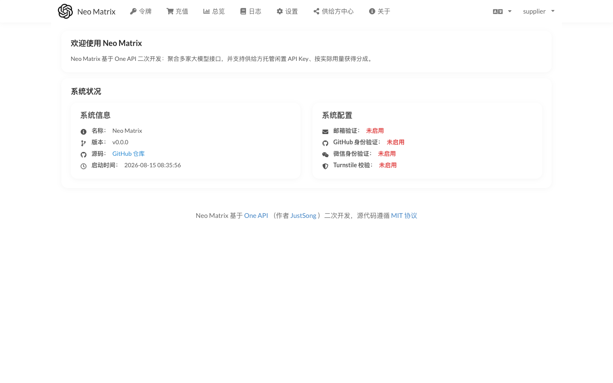
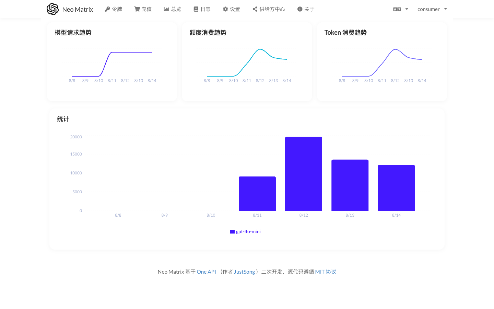
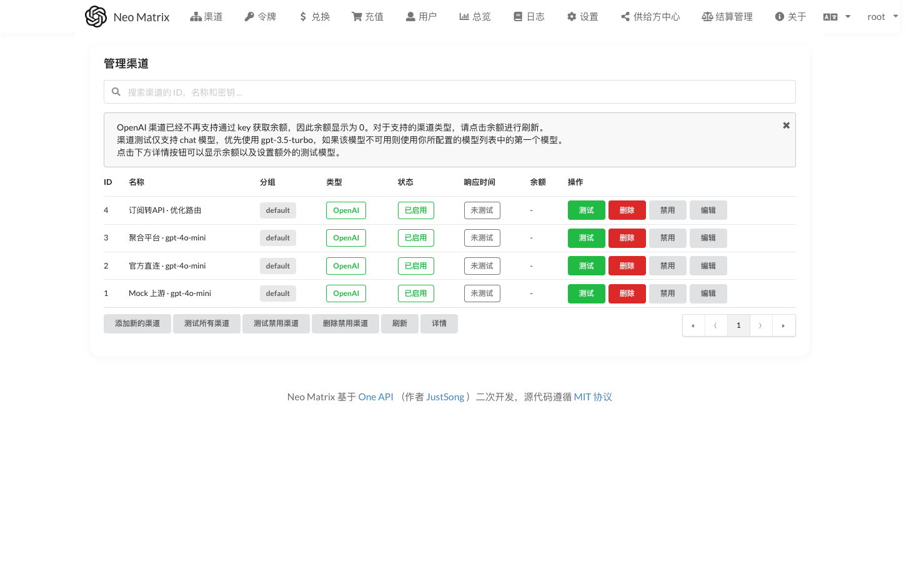
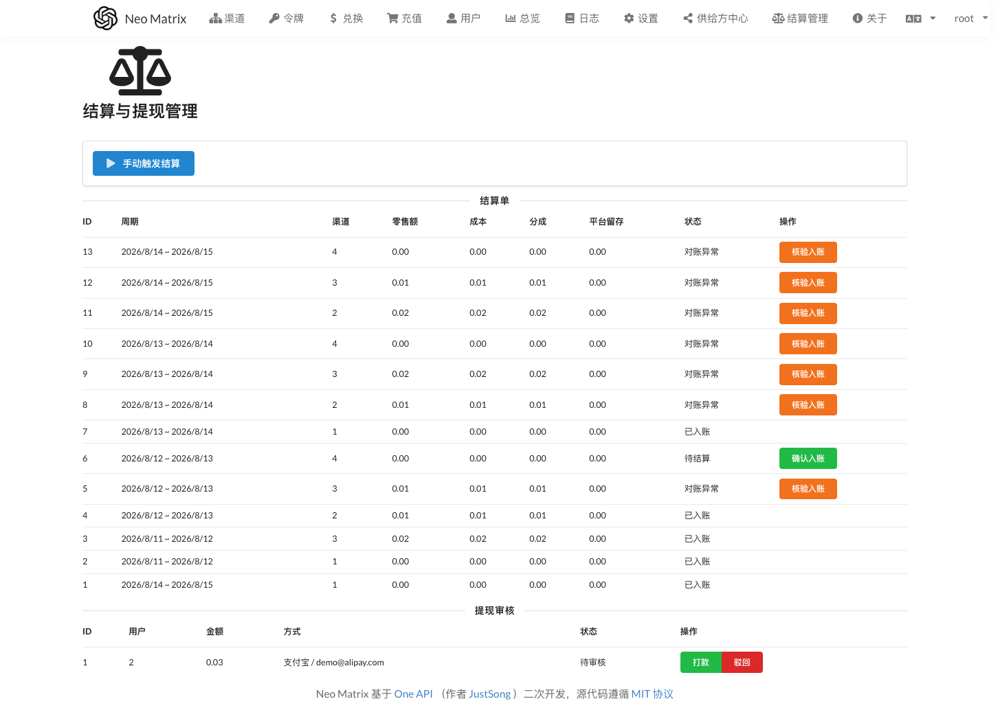
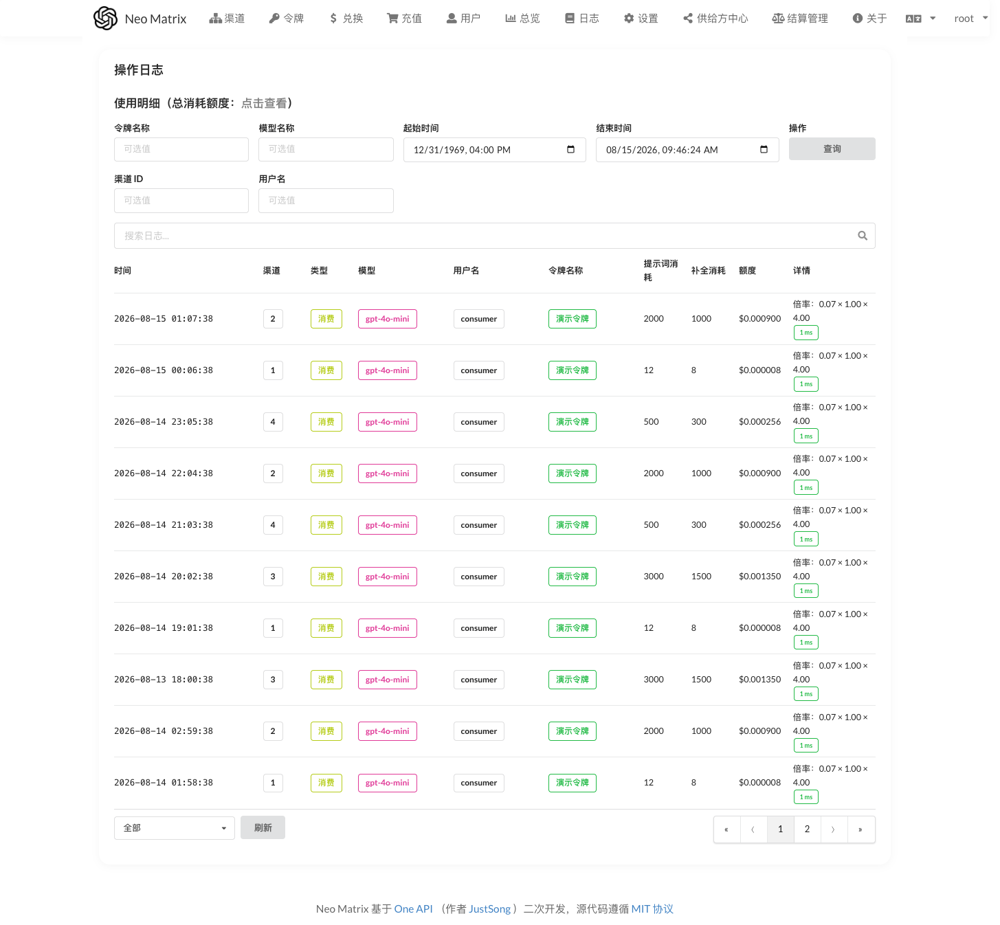
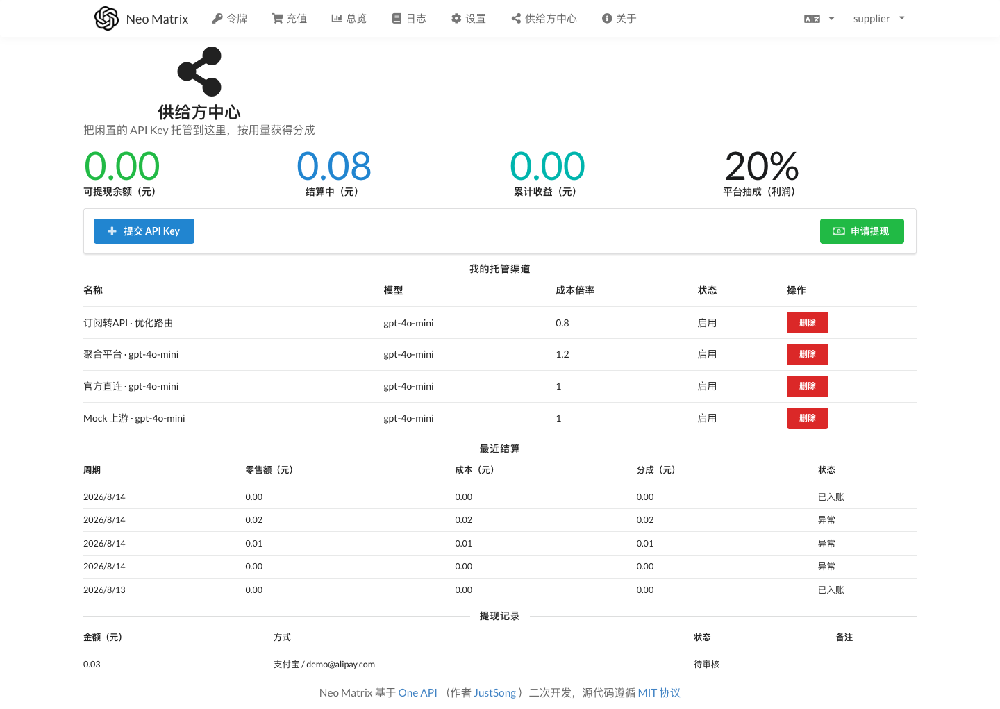
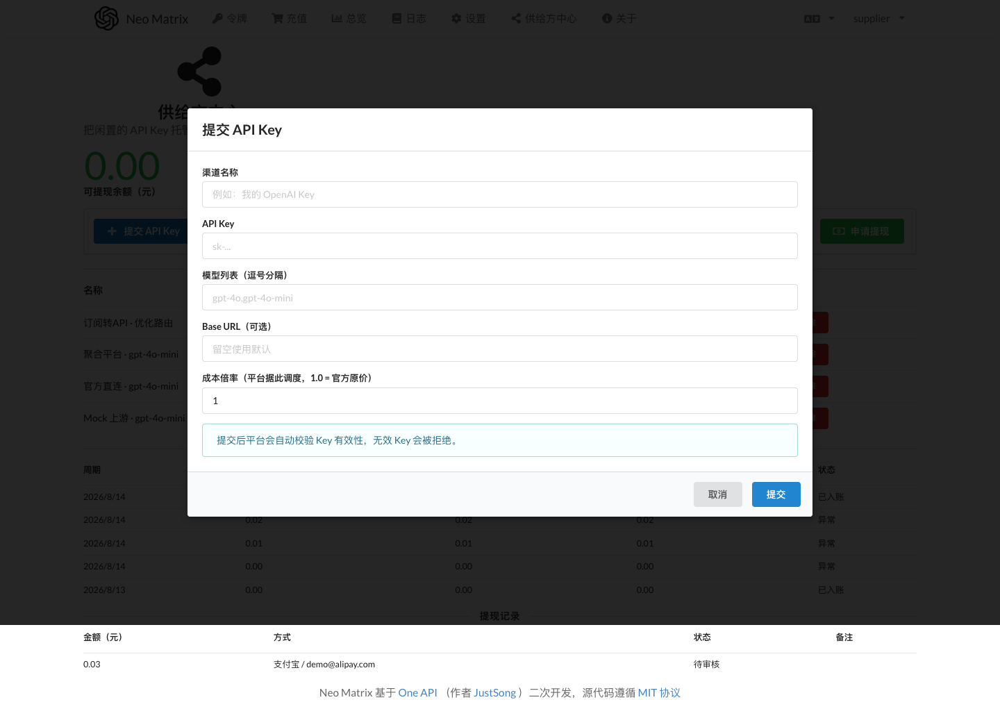
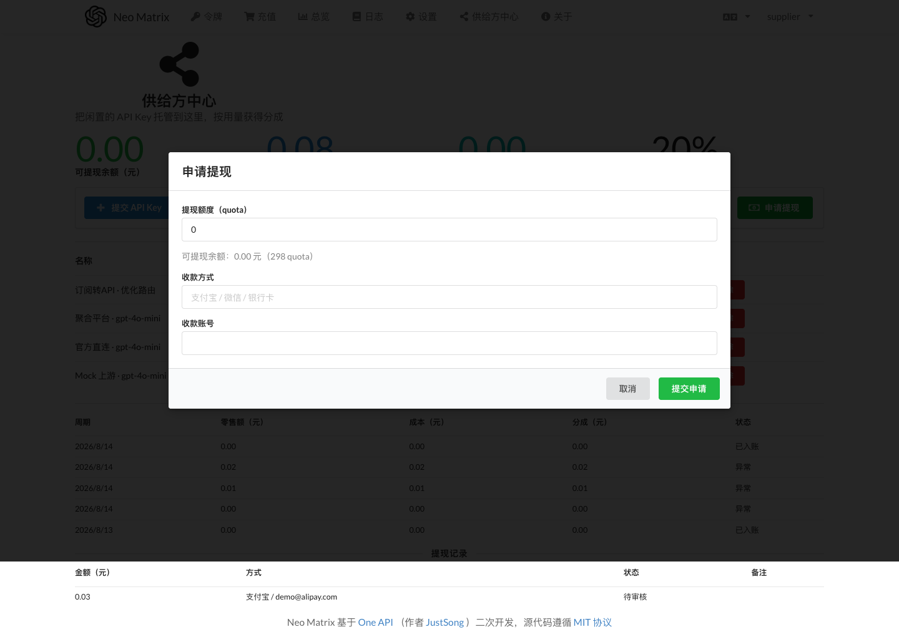
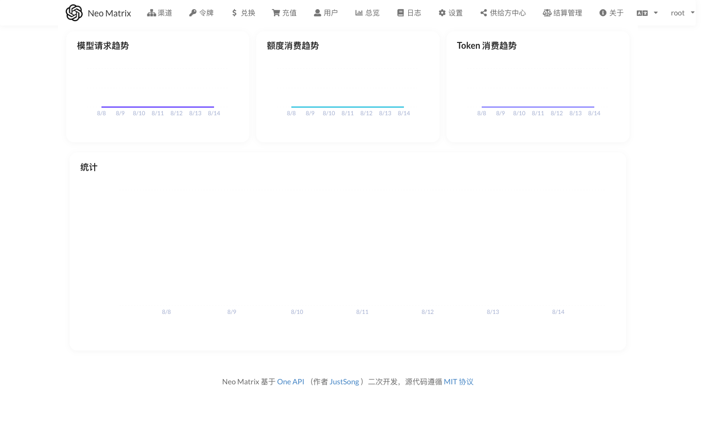

# Neo Matrix —— 共享 AI 中转站：把闲置 API Key 汇成一个入口

> 基于 one-api（MIT）二次开发的**共享 AI 中转站**：消费者通过一个标准 OpenAI 兼容接口访问所有大模型；供给方把闲置 API Key 托管到平台，平台自动调度这些 Key 处理请求，并按真实用量给供给方分成、可提现。



## 它解决什么问题

大家手里通常有好几个 API Key：OpenAI、DeepSeek、Gemini、各种聚合平台…… 用的时候要在不同服务商之间切换、分别计费、分别管理余额。Neo Matrix 把这些 Key **汇总成一个入口**：

- **消费者**：只认一个 `sk-xxx` 令牌，所有模型在一个地方按用量付费，不用管背后是哪个上游在服务。
- **供给方**：闲置的 Key 不再吃灰，托管到平台就能按真实消耗获得分成，钱可以提现。
- **平台**：同一模型有多家供给方时，自动走**成本最优**的渠道，把平台利润做大。

## 架构一览

Neo Matrix 完整继承 one-api 的能力：40+ 上游渠道适配、额度计费、分组权限、渠道健康监控。在它之上，本项目增加了一条完整的**供给侧经济闭环**：

```
消费者 (sk-xxx 令牌)
   │  标准 OpenAI 兼容 API /v1/chat/completions
   ▼
Neo Matrix 平台
   │  ├─ 成本最优路由：同模型多渠道，按成本倍率 × 信任加权选路
   │  ├─ 消费日志记账：零售价（消费者付） + 成本价（付给上游）
   │  └─ 分成结算：按周期聚合日志 → 平台与供给方按比例分账
   ▼
上游渠道（供给方托管的 Key）
```

### 三条核心设计标准

1. **消费者价 = 平台统一价**，不随渠道浮动——消费者看到的价格与背后是哪个上游无关。
2. **成本价锚定官方基准**：供给方声称的成本倍率被约束在 `[1.0, 3.0]` 之间（低于 1.0 = 恶意低报抢量，高于 3.0 = 虚报抬结算），且需管理员审批。
3. **平台盈利与调度解耦**：平台靠分成 + 流水盈利，不靠压榨渠道成本。

## 本地跑起来

```sh
# 1. 构建前端（构建产物不随仓库提交，首次必须执行）
cd web/default && npm install && npm run build && cd ../..

# 2. 配置并启动后端
cp .env.example .env            # 设置 SESSION_SECRET（openssl rand -hex 32）
go run .                        # 默认 SQLite，开箱即用
```

启动后访问 `http://localhost:3000`，首次启动自动创建管理员 `root / 123456`。

---

## 界面导览

以下截图来自一次**真实的端到端演示**：注册了 2 个用户（供给方 `supplier`、消费者 `consumer`），供给方托管 4 个渠道，消费者通过标准 API 消费了 35 次请求，跨 5 个自然日，系统自动/手动生成了 13 张结算单——其中 5 张正常入账、1 张待结算、7 张对账异常待核验，供给方还发起了提现申请。整个闭环全部走真实 HTTP API，没有手工造数据。

### 1. 消费者视角：用量总览

消费者登录后能看到模型请求趋势、额度消费趋势、Token 消费趋势三张图。下图是 `consumer` 的真实消费（`gpt-4o-mini` 累计消耗 10,239 quota，折合约 ¥0.14）：



### 2. 渠道管理：成本倍率 × 信任等级

平台管理端能看到所有渠道。4 个演示渠道展示了不同档位的成本倍率与信任等级——这正是"成本最优路由 + 信任阶梯"的可视化：

- **官方直连 · gpt-4o-mini**：成本 1.0（= 官方价），信任 5（最高）
- **聚合平台 · gpt-4o-mini**：成本 1.2（聚合路由有溢价），信任 4
- **订阅转API · 优化路由**：成本 0.8（低于官方价 → **待成本申报审批**），信任 2（新渠道爬坡期）



> 注意"订阅转API · 优化路由"渠道：它的成本倍率 0.8 < 1.0，按规定必须走**成本申报**由管理员核准后才能放开成本下限。这是防止"低报抢调度量"的关键设计。

### 3. 结算与提现管理（核心页）

平台管理端一张页面同时管两件事：**结算单**和**提现审核**。

13 张结算单横跨 5 天，呈现三种状态：

- **已入账**：正常结算，金额已从"结算中"转入供给方"可提现余额"
- **待结算**：刚生成，等待确认入账
- **对账异常**：`used_quota` 增量与消费日志总量偏差超过阈值 → 标记异常，管理员**核验后手动入账**（橙色按钮）



提现审核区支持**打款 / 驳回**，驳回时金额自动退回供给方可提现余额。整个过程用原子状态翻转防止并发重复入账 / 重复退款。

### 4. 消费日志：零售价与成本价双记账

每一笔消费都同时记录**零售价（消费者实付）**与**成本价（付给上游）**两笔 quota——这就是分成结算的数据基础。



### 5. 供给方中心

供给方登录后是独立的供给方视角：可提现余额 / 结算中 / 累计收益 / 平台抽成比例，以及自己的托管渠道和最近结算。



顶部四个数字卡片一眼看清账目：**可提现余额、结算中余额、累计收益、平台抽成（20%）**。下方是托管渠道列表（含成本倍率）和最近结算记录。

### 6. 供给方提交 Key

供给方在中心页点"提交 API Key"，填写渠道类型、Key、成本倍率后提交。平台会先**自动校验 Key 有效性**（真实发一次测试请求），有效才创建渠道；无效 Key 直接拒绝。



提交时填写的成本倍率会被强约束在 `[1.0, 3.0]`，低于官方基准的申请会进入**成本申报审批**流程，由管理员人工核验（防止低报抢量 / 虚报抬结算）。

### 7. 供给方申请提现

结算入账后，钱进入"可提现余额"，供给方填写金额与收款方式发起提现申请，管理员在结算页审核打款。



### 8. 管理员总览

管理员登录后默认进入平台总览页，看到全平台的请求趋势与额度消费趋势。



---

## 演示数据里的一个小故事

回看结算页（第 3 节）那张截图，有 7 张结算单标着**对账异常**。这其实不是 bug，而是**对账机制在真实工作**：

演示时我把消费日志的 `created_at` 回填到了过去 5 个自然日，但渠道的 `used_quota` 累计值是"今天"才加上去的。于是结算对账时，`used_quota` 的周期增量与日志总量对不上，超过 20% 阈值即判为异常 → 标记 `对账异常`，等待管理员核验（页面上的橙色"核验入账"按钮）。这正是项目里"结算对账 + 降权"防线的设计场景：**宁可标出来人工核验，也不让异常流水悄悄入账。**

> 顺带一提：这 7 张异常单恰好是在上一轮结算加固（P7c）之前就写进库的历史单——加固后**重跑不会再污染对账基准**，且异常单也能被"核验入账"，而不再永久冻结。详见 [UPGRADE.md](UPGRADE.md)。

（真实运营中，若对账异常连续出现，渠道信任等级会被逐步调低、选中概率下降，形成负反馈。）

## 代码里值得一看的几处设计

- **成本最优路由**（`model/cache.go`）：同优先级渠道内按 `1/(成本×信任惩罚)` 加权随机，成本低、信任高 → 选中概率大；低信任渠道保留非零概率，保证新渠道能"爬坡"。
- **套利防线**：供给方既是供给者又是消费者时，调度会排除它自己托管的渠道（`excludeOwnerId`），从机制上杜绝"自产自销套分成"。
- **幂等结算**：结算单有 `UNIQUE(period_start, period_end, channel_id)` 唯一索引，重跑不重复入账；`settling_balance` 用 CAS 条件更新同步差额，并发重跑不会双计入。
- **对账快照**：每张结算单记录 `used_quota_end` 作为下一周期对账的增量基准，重跑历史单不会污染基准。

## 项目状态

| 阶段 | 内容 | 状态 |
|---|---|---|
| P0 | fork + 模块重命名 + 品牌化 | ✅ |
| P1 | 成本最优路由 + 消费日志成本记账 | ✅ 已测试 |
| P2 | 供给方角色 + Key 托管预校验 | ✅ 已端到端验证 |
| P3 | 分成结算 + 供给方看板（幂等、对账异常标记） | ✅ 已端到端验证 |
| P4 | 提现闭环（申请 / 打款 / 驳回退余额） | ✅ 已端到端验证 |
| P5 | 订阅转 API 扩展预留 | ✅ 已验证 |

## 更多文档

- [改造架构](ARCHITECTURE.md) — 分阶段计划、数据表设计、路由/计费机制详解
- [供给侧定价标准](SUPPLIER_PRICING.md) — 三条核心标准与实现对照
- [平台规则](rules/RULES.md) — 供给方准入 / 结算 / 提现 / 违规处罚
- [部署指南](DEPLOYMENT.md) — 单机 / 生产 / 离线部署
- [升级指南](UPGRADE.md) — 升级步骤 / 行为变更 / 回滚
