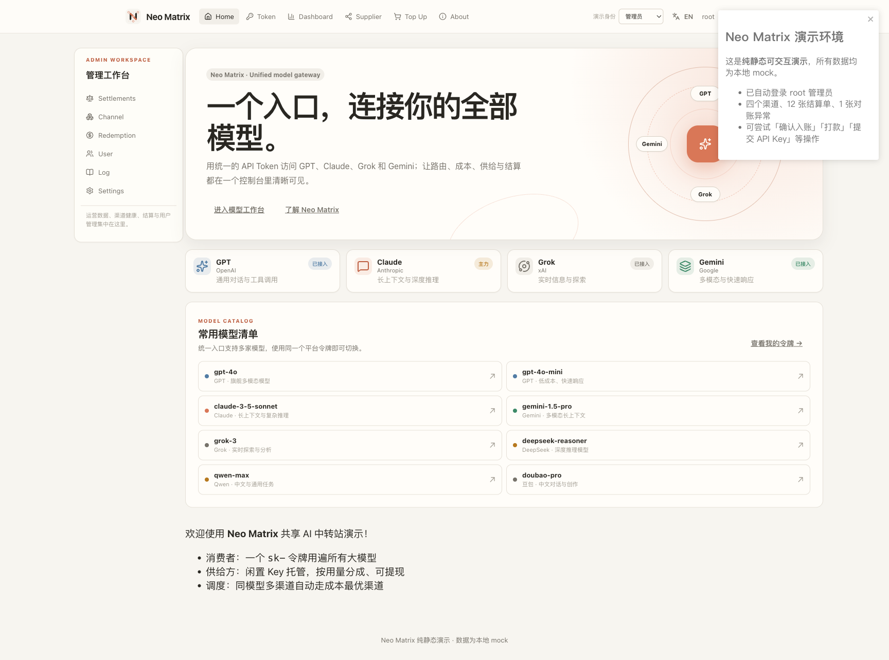
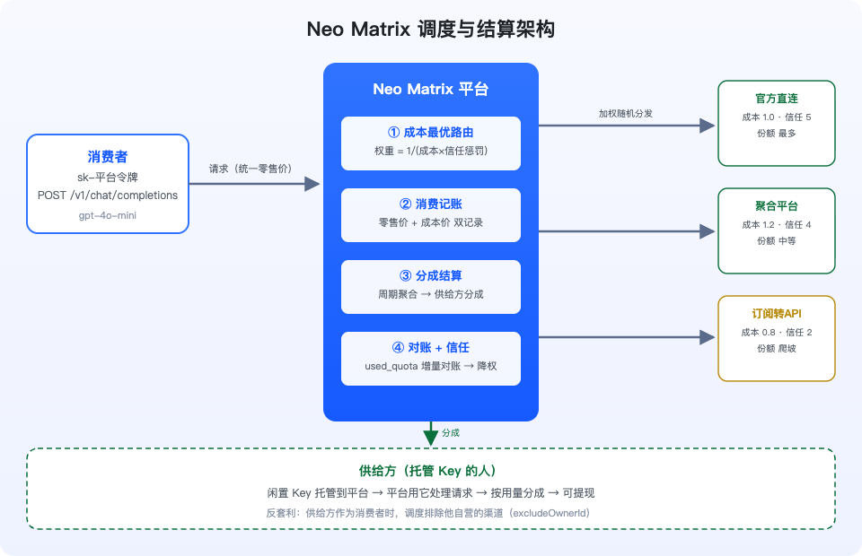
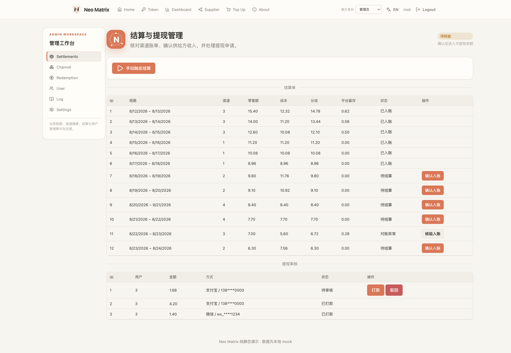
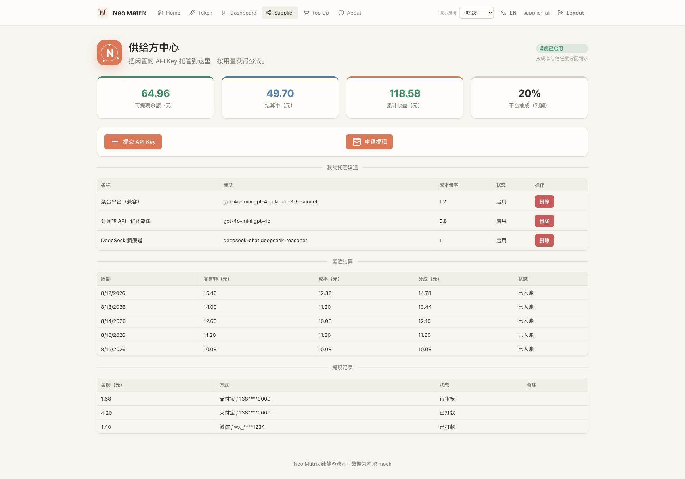
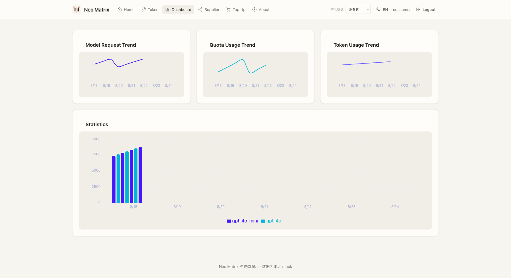

# Neo Matrix 项目说明（Project 2）

> Neo Matrix 是一个基于 one-api 改造的 **OpenAI 兼容中转网关 + 个人供给源与分成结算层**。消费者只需要一个平台令牌，就可以访问平台接入的多种模型；供给方可以托管闲置的上游 API Key，按实际用量获得分成并申请提现。

## 1. 项目定位

Neo Matrix 不只是把多个模型放到同一个页面里，而是把“请求路由、渠道成本、供给方收益、对账和提现”串成一条可追踪的业务链：

- **消费者**：使用平台签发的 `sk-...` 令牌，通过标准 OpenAI 接口访问模型。
- **供给方**：提交自己的上游 API Key，作为渠道参与调度，按真实消费获得收益。
- **平台管理员**：管理渠道、用户和系统设置，运行结算、核验异常账单、审核提现。



上图是当前纯静态演示的管理员首页。页面展示的是本地 mock 数据，不会调用真实模型、真实账户或真实支付接口。

## 2. 两种 Key：平台令牌与上游 Key

| | 消费者平台令牌 | 供给方上游 Key |
|---|---|---|
| 示例 | `sk-demo-...` | OpenAI、DeepSeek 或其他上游服务商 Key |
| 签发/提交 | 平台令牌页创建 | 供给方中心提交 |
| 用途 | 调用 `/v1/chat/completions` | 平台调用上游渠道 |
| 可见范围 | 消费者本人 | 平台服务端/管理端 |
| 是否决定路由 | 否 | 参与候选渠道池 |

消费者拿到的是平台令牌，不是供给方的上游凭证。请求进入平台后，平台根据模型、优先级、成本和信任等级选择具体渠道。

## 3. 请求与结算架构



一次请求的大致路径如下：

```text
消费者平台令牌
      │
      ▼
鉴权与模型权限检查
      │
      ▼
按优先级分组 → 成本/信任加权选渠道
      │
      ▼
调用供给方托管的上游 Key
      │
      ├─ 记录消费者零售价
      ├─ 记录渠道成本价
      └─ 写入消费日志与渠道累计用量
               │
               ▼
周期结算 → 对账 → 供给方余额 → 提现审核
```

核心代码位置：

- 路由与渠道能力：`model/cache.go`、`model/ability.go`、`model/channel.go`
- 供给方 API 与安全校验：`controller/supplier.go`、`middleware/auth.go`
- 结算、对账与信任变化：`model/settlement.go`
- 供应方余额与提现状态：`model/supplier.go`
- 静态演示 mock：`web/default/src/helpers/demoData.js`、`web/default/src/helpers/mockAdapter.js`

## 4. 成本感知的渠道调度

同一个模型可能对应多个渠道。Neo Matrix 不是简单地随机选一个渠道，而是先按 `priority` 选择最高优先级组，再在组内进行加权选择：

```text
RoutingWeight = 1 / (cost_ratio × trust_penalty)
```

- 成本倍率越低，路由权重越高。
- 信任等级越高，惩罚越小。
- 新渠道仍保留非零概率，可以通过真实运行逐步爬坡。
- 如果消费者同时是某个渠道的供给方，调度会排除其自有渠道（`excludeOwnerId`），防止自产自销套取分成。

需要区分两种成本：

- `EffectiveCost`：用于消费记账和结算，是渠道真实成本口径。
- `RoutingCost`：在路由选择时额外叠加信任惩罚，不应直接当作结算成本。

## 5. 信任等级与风险控制

渠道信任等级为 1—5：新渠道低信任起步，正常运行后逐步获得更多流量；异常渠道则被降权。

- 连续 **7 个周期对账正常**：信任等级自动提升 1，最高 5。
- 连续 **2 个周期对账异常**：信任等级自动降低 1，最低 1。
- 成本倍率通常限制在 `[1.0, 3.0]`，低于官方基准的成本申报需要额外审批。
- 供给方 BaseURL 需要通过 HTTPS/公网地址等校验，降低 SSRF 风险。
- 提现扣款使用原子更新，避免并发重复提现或余额变负。

## 6. 结算与对账

每笔消费同时记录零售价和成本价。默认平台抽取利润的 20%：

```text
利润 = 零售价 − 成本价
供给方分成 = 成本价 + 利润 × (1 − 平台抽成比例)
平台留存 = 零售价 − 供给方分成
```

对账不能直接拿累计 `used_quota` 与单周期日志比较。系统会保存每张结算单的 `used_quota_end` 快照，并用相邻快照的差值计算周期增量。偏差超过 20% 时，结算单进入异常状态，管理员可以人工核验后入账。

实现上还需要处理三个并发问题：

1. 历史周期重跑不能覆盖后续周期的对账基准。
2. 同一结算单重复运行不能重复增加余额。
3. 后台任务与管理员操作并发时不能双计入。

因此结算更新使用唯一约束、事务和 CAS 条件更新；待结算或异常结算单只有在状态转换成功后才会影响余额。



## 7. 三种身份的界面

### 管理员

管理员可以访问管理工作台：渠道、用户、日志、兑换码、设置、结算和提现审核。管理员也可以手动触发结算，并对异常结算单执行核验入账。

### 供给方

供给方中心展示：

- 可提现余额
- 结算中余额
- 累计收益
- 平台利润抽成比例
- 自己托管的渠道
- 最近结算和提现记录



当前静态演示中的供给方数据来自 `demoData.js`：包含 4 个演示渠道中的 3 个供给方渠道、12 条结算记录和提现历史。金额是演示数据，不代表真实收入。

### 消费者

消费者可以查看用量看板、管理平台令牌、充值兑换码，并通过统一入口使用模型。



## 8. GitHub Pages 纯静态演示

在线演示使用 `REACT_APP_DEMO=true` 构建：

- `HashRouter` 使 GitHub Pages 子路径和刷新安全。
- Axios adapter 拦截 `/api/*` 请求，返回本地内存数据。
- 页面操作会修改当前浏览器内存中的 mock 状态。
- 刷新页面后会重新载入演示数据，不会写入后端数据库。
- 不需要 Go 服务、SQLite、真实 API Key 或上游账号。

预期地址：

```text
https://liyuk.com/neo-matrix/
```

三种身份可以通过顶部“演示身份”选择器切换，也可以直接使用 URL 参数：

```text
https://liyuk.com/neo-matrix/?demo_user=admin#/
https://liyuk.com/neo-matrix/?demo_user=supplier#/supplier
https://liyuk.com/neo-matrix/?demo_user=consumer#/dashboard
```

注意：`demo_user` 必须放在 `#` 之前，因为它由 `window.location.search` 读取。选择器切换后会保留当前页面路径并重新加载对应身份的数据视图。

本地构建与静态预览：

```bash
cd web/default
npm install
PUBLIC_URL=/neo-matrix \
REACT_APP_DEMO=true \
DISABLE_ESLINT_PLUGIN=true \
npm run build
```

GitHub Actions 工作流位于 `.github/workflows/demo-pages.yml`，会在 `main` 分支的前端或 workflow 变化后构建 `web/build/default`，再使用 `actions/deploy-pages` 发布。仓库 Settings → Pages 的 Source 需要设置为 **GitHub Actions**。

## 9. 截图说明

本文截图分为两类：

- `docs/images/00-architecture.png` 等历史编号截图：来自项目早期的端到端页面演示。
- `14-demo-*` 至 `17-demo-*`：在当前生产构建的纯静态 mock demo 中重新捕获，使用本地 HTTP 静态服务器验证资源路径和 HashRouter。

静态 demo 中的数字、用户、Key、提现账户和渠道地址均为虚构数据。不要把真实上游凭证粘贴到演示环境。

## 10. 局限与生产注意事项

- 纯静态演示没有真实模型调用、真实计费、邮件、OAuth 或支付。
- mock 数据只存在于浏览器内存，刷新后重置。
- 生产环境仍需要后端、数据库、密钥管理、上游服务协议和合规审查。
- 供给方 Key 托管涉及上游账户风险、滥用风险和数据安全责任，应配置最小权限、审计、撤销和异常处理流程。
- 低价渠道、图像/音频等非文本计费、上游账单差异等情况需要持续补充更严格的成本核验。

相关文档：

- [改造架构](docs/ARCHITECTURE.md)
- [供给侧定价标准](docs/SUPPLIER_PRICING.md)
- [平台规则](docs/rules/RULES.md)
- [部署指南](docs/DEPLOYMENT.md)
- [升级指南](docs/UPGRADE.md)
- [可行性与风险](docs/FEASIBILITY.md)
